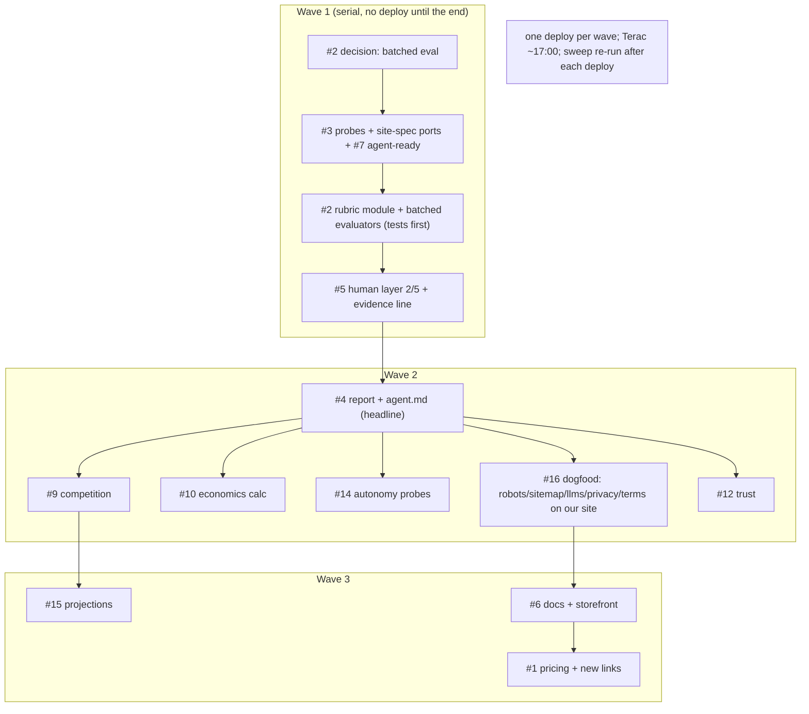

# zero-human issue queue: disposition + execution DAG (matra protocol)

Written at 12:25 PDT with 6h to lock (18:30). Reconstructed from the live repo (main `d86f4ae` + 1 pushed fix), the live Render instance, and issues #1-#18. Protocol: `blinkbuild/matra-suite/.claude/skills/execution-protocol/SKILL.md` (issues-first serial cycle, forensics first, tests first on protected surfaces, WIP cap 1, blind verify per merge, receipts on the issue).

## 1. Facts that bound the plan

- Machine is done for the OLD product (28 tests, live, money path proven to the poller, Terac/Replay/Linq wired). Revenue \$0, Terac untouched by decision (5pm run).
- Free Render tier: DB wiped on every deploy. Aria: do not worry about it now. Consequence: batch deploys; one deploy per wave, not per commit.
- Evaluator throughput is the hard resource: Groq free tier ~30 RPM. Today's rubric (15 lenses, ~55 claims) x 3 personas = ~165 calls per job = 6+ minutes and 429s. Any lens design that puts every claim through the LLM is infeasible today. Objective lenses (probes, agent-ready, Replay, site-spec ports) cost zero LLM calls; the human layer costs zero LLM calls. Model calls must be reserved for clarity/demand/viability/competition/trust/projections and even those need one call per lens (batched claims), not one per claim per persona.
- Draft `reality_check/lenses.py` exists UNTRACKED on disk (written before Aria said stop). Not wired, not committed. Keep or delete is a #2 decision.

## 2. Issue-by-issue disposition

| # | Title | Verdict | Falsifiable acceptance present? | Depends on |
|---|---|---|---|---|
| 18 | EPIC | status board | n/a | all |
| 17 | Persistence (Render disk) | PARKED by Aria; deploy in batches | yes | Aria card |
| 1 | Pricing rethink | PARKED by Aria (build first, price last) | yes | 2,5 |
| 2 | Lens rubric module | READY. Needs one design decision first: batched evaluation (one model call per lens returning per-claim p) or per-claim calls. Recommendation: batched, else infeasible (see 1). | yes | none |
| 3 | Objective probes (site-spec port) | READY, no LLM, no dependency. Best first build. | yes | none |
| 7 | Agent-ready lens (isitagentready API) | READY, tiny, verified API. Fold INTO #3 (same probes module, same finding shape) rather than a separate module. | yes | 3 |
| 4 | Report + agent.md (headline) | READY once 2+3 exist; the renderer reads findings + claims. | yes | 2,3 |
| 5 | Human layer per tier (2/5, evidence line) | READY, small; independent of lenses except the evidence line text. | yes | 2 (weak) |
| 6 | Docs + storefront copy | after 4 | yes | 4 |
| 8 | SEO lens | ABSORBED by #3 (site-spec audit ports carry all SEO ids). Keep issue for the model "search-user" read only; low priority. | yes | 3 |
| 11 | Legal lens | ABSORBED by #3 (probe /privacy /terms /contact). | yes | 3 |
| 13 | A11y + perf | mostly ABSORBED by #3 (viewport-lock, img alt/dims, lcp-lazy) + Replay polish read (later). | yes | 3, replay |
| 10 | Economics calculator | needs one structured model call (extract numbers) + deterministic math. Wave 2. | yes | 2 |
| 14 | Autonomy depth | probes for self-serve buy + support; defaults in rubric. Wave 2. | yes | 2,3 |
| 9 | Competition | one model call, model-only labeled. Wave 2. | yes | 2 |
| 12 | Trust | model + humans. Wave 2. | yes | 2,5 |
| 15 | Projections | one model call. Wave 3. | yes | 2 |
| 16 | Dogfood our own site | after 3 (we will fail our own probes: no robots/sitemap/llms/privacy today). Cheap static files. Wave 2. | yes | 3 |

Nothing is superseded outright; 8, 11, 13 shrink to "render + optional model read" once #3 lands.

## 3. The design decision to make BEFORE building (#2)

Batched evaluation: per lens, ONE model call per persona returns JSON `{claims:[{idx,p,side,reasoning}]}` for all that lens's claims. 15 lenses x ~2 personas = ~30 calls per job (vs 165). consensus.evaluate stays per claim (it just gets its votes from the batched result). Cost: a small change to evaluators.py (new `evaluate_batch(claims, text, personas)`), the stub path too. Objective lenses: zero calls. This is the only way the full rubric runs inside a minute on free tiers. Alternative (reject): keep per-claim calls and cut the rubric to 6 lenses.

## 4. The DAG

Cycle per issue: forensics (read the file, not the recap) -> red test -> build on main (WIP 1) -> 28+ tests green -> push -> receipt comment on the issue -> next. Blind verify: one adversary pass per wave, not per issue (time). Deploy at wave ends only.

## 5. Estimates (agent wall-clock)

Wave 1: ~75 min (probes 30, batched evaluators + rubric 30, human layer 15). Wave 2: ~90 min (report + agent.md 45, dogfood 15, econ/autonomy/competition/trust 30 batched). Wave 3: ~40 min. Total ~3.5h of a 6h window, leaving the Terac run, storefront hookup, and slack for the unknowns.
